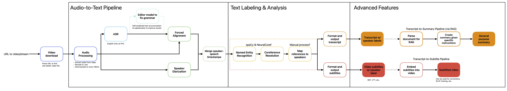

# Congressional Hearing Transcription & Summarization Pipeline
> An automatic extended-format multi-speaker recording transcription pipeline



## Introduction
This project is a way to gain experience with various machine learning methods and tools, particularly in the areas of ASR and NLP. This pipeline is comprised of open tools and models. Data used for inferencing is part of public record.

> **Disclaimer**: This is an automated tool designed to convert audio recordings of congressional hearings into text. It is intended solely for providing accurate transcriptions, without political bias or interpretation. The tool transcribes speech as faithfully as possible, but users should be aware that automatic transcription may have limitations, including errors in speaker identification or accuracy. The text editing capabilities of this project are designed solely to address grammatical errors. The project does not endorse or reflect any political views.

## Table of Contents
1. [Getting Started](#getting-started)
1. [Usage](#usage)
    - [How do I use this?](#how-to-use-the-pipeline)
    - [How do I get the stream manifest URL for a Senate Hearing?](#how-do-i-get-the-stream-manifest-url-for-a-senate-hearing)
    - [How do I find the stream manifest URL for a House hearing?](#how-do-i-find-the-stream-manifest-url-for-a-house-hearing)
    - [What does it do?](#what-does-it-do)
1. [Roadmap](#roadmap)
1. [Acknowledgements](#acknowledgements)

## Getting Started
Getting started is easy. We provide two options to use the same environment:

With Conda:
```python 
conda env create -f requirements.yml
conda activate hearings
```
OR, with pip:
```python
pip install -r requirements.txt
```

If you would like to manually create an environment (or if the provided environment files don't work for you), follow the installation instructions provided by the following projects:
- [NVIDIA NeMo](https://github.com/NVIDIA/NeMo/tree/main?tab=readme-ov-file#install-nemo-framework)
- [BetterWhisperX](https://github.com/federicotorrielli/BetterWhisperX?tab=readme-ov-file#setup-%EF%B8%8F)
- [Huggingface Transformers](https://github.com/huggingface/transformers?tab=readme-ov-file#installation)
- yt-dlp

> Note: Some parameters will require additional configuration depending on your hardware. Currently, this code is optimized to use up to 24GB of VRAM. You may need to optimize parameters for your machine

> Node: Once run, the models alone will consume about 5GB of disk space. Make sure to also leave space for interim and output files, or else the pipeline will fail. I plan to implement an option to remove or ignore interim files to reduce bloat

## Usage
> Please note that additional features are under development, so usage instructions may change
### How to use the pipeline
Inputs to run the pipeline are in the format:
```python
python run.py [URL]
```
where, the URL entered needs to point to either the stream manifest of an online video (e.g., a .m3u8 file) OR a video on a site supported by yt-dlp. Congressional hearings usually take place on either `*.senate.gov` (for Senate hearings) or on `youtube.com` (for House hearings). See [demo.sh](/demo.sh) for examples.

### How do I get the stream manifest URL for a Senate Hearing?
To find the URL to the stream manifest of a Senate hearing, we recommend:
1. Navigate to the hearing page using a web browser. E.g. [Senate Finance: Providing Small Business Relief from Remote Sales Tax Collection](https://www.finance.senate.gov/hearings/providing-small-business-relief-from-remote-sales-tax-collection)
1. Open the stream of a hearing in a new tab or window
1. Open your browser's Web Inspector and navigate to the "Network" tab
1. Reload the page
1. Filter the results of the loaded page for `master.m3u8` (or just `.m3u8` if it doesn't appear).
1. Right-click and select `Copy Link` (or your browser's equivalent)

You should now be able to paste the URL as an argument.

### How do I find the stream manifest URL for a House hearing?
The yt-dlp project is configured to handle links from YouTube, so please enter the _full_ URL from your browser (e.g., https://www.youtube.com/watch?v=dQw4w9WgXcQ)

### What does it do?
Once run, the pipeline will automatically:
- Create several folders to hold interim files
- Download the necessary models for each feature (none require an API token)
- Process the video & audio
- Transcribe the hearing
- Separate and match speech to (generic) speakers
  - By this, we mean that the pipeline is **not** (yet) capable of denoting who the speaker is (e.g., Sen. Wyden). However, segments should be labeled (e.g., speaker_2) in a way such that replacing each instance of a label with the speaker's name (e.g., speaker_2 -> Sen. Wyden) should match what you would find by inspecting the original
- Output the "complete" hearing transcript with speech matched to speakers as a text file

See the examples folder for ouputs from hearings that contained: 20 mins, 2 hours, and 10 hours of speech, respectively.

At present, the pipeline does not "clean up" the interim files to allow you to inspect them for errors.

## Roadmap

This segment discusses completed and planned work on this project.

### Checkpoint 1: Baseline Transcription Function
- [X] Download video file from given URL
    - [ ] Custom handler to simply process of obtaining Senate hearing manifests? 
- [X] Extract audio from video file
- [X] Recode audio to supported format (16kHz WAV)
- [X] Transcribe audio file
- [X] (Optional) Incorporate a method of correcting grammar in transcripts
- [ ] Remove hard-coded values for batch processing and move to config file(s) and/or program args
    - It would be nice to include an auto-batching feature like [PyTorch Lightning's Batch Size Finder](https://lightning.ai/docs/pytorch/stable/advanced/training_tricks.html#batch-size-finder) or the original [BlackHC's TOMA](https://github.com/BlackHC/toma)
- [ ] Separate features into argument flags to allow for more customization
- [ ] Clean up debugging and configure proper logging
- [ ] Process queue to handle multiple inputs?

### Checkpoint 2: Forced Alignment and Speaker Separation
- [X] Segment- and Word-Level forced alignment to ensure accurate separation (included in WhisperX)
    - Optionally, separate this out to allow customization
- [X] Speaker Diaraization (handled via NeMo)
- [ ] Remove hard-coded values for batch processing and move to config file(s) and/or program args
- [ ] Clean up debugging and configure proper logging

### Checkpoint 3: TBD

Future plans and posibilities are discussed in [ROADMAP.md](/ROADMAP.md).
To suggest new features or report bugs, please open an issue at https://github.com/jramthun/hearing-pipeline/issues

## Acknowledgements
All models utilized in the development this project are open-source and/or openly available. Models may swapped as improvements are made in varying fields (e.g., NeMo MSDD -> Sortformer-based e2e diarization).

While developing this pipeline, I utilized the following models, frameworks, and tools to learn how to perform and combine ASR and NLP tasks into one relatively-simple format (listed in alphabetical order):
- Cohere:Command-R
- Grammarly-CoEdIT
- Kaldi ASR
- Montreal Forced Aligner
- NVIDIA NeMo
- NVIDIA:Canary
- NVIDIA:Parakeet (CTC, RNN, and TDT)
- Ollama
- OpenWebUI
- pyannote
- Qwen:Qwen-Audio
- Whisper.cpp
- Whisper/Faster-Whisper/Distil-Whisper
- WhisperX/BetterWhisperX
